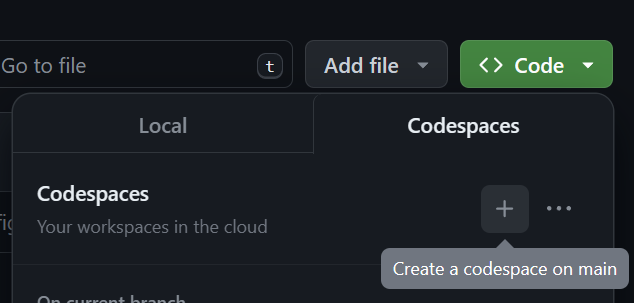
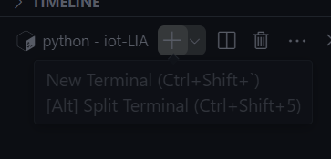

# Codespace template for IoT and Smart devices

This repo serves as a template for running configured virtual environment.

## Create a Codespace to run Counterfit

You simply press **`< > Code`** button and create a Codespace on `main`



## Usage

From codespace terminal, launch CounterFit app with the following command

```bash
counterfit
```

The terminal will return output:

```bash
CounterFit - virtual IoT hardware running on port 5000
```

this will be automatically forwarded to your local machine.

Open [http://localhost:5000/](http://localhost:5000/) in your browser to access to counterfit.

> ***Note**: to use the terminal for other task, you can create another one with the plus sign on the right of the terminal.*
> 
> 
